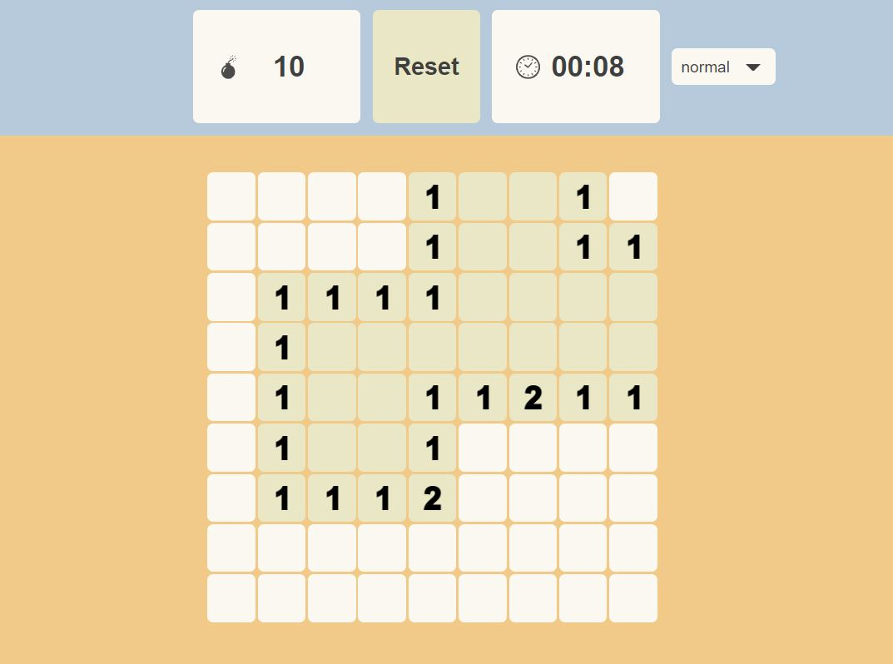
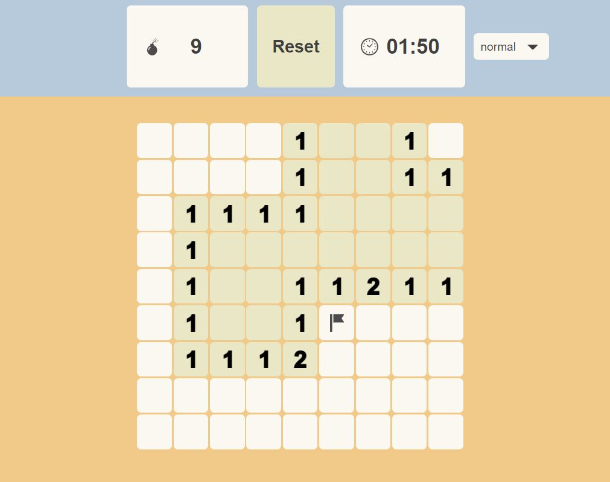
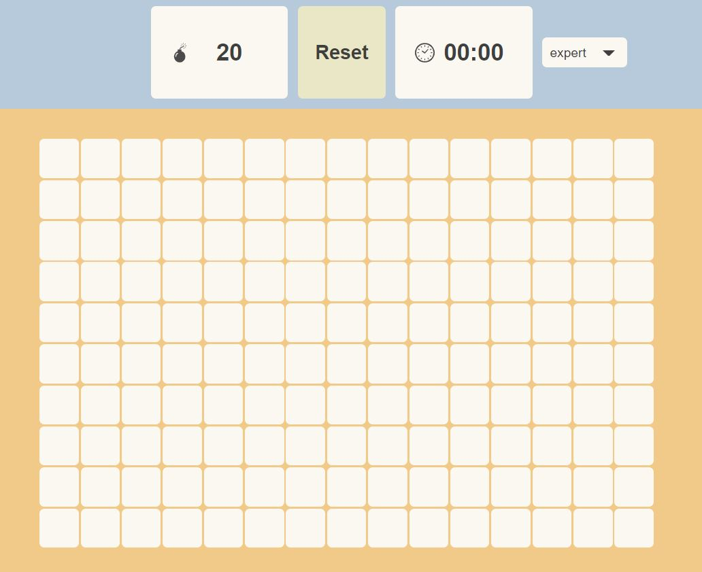

# mine-sweeper
Vue.jsで作ったマインスイーパーゲームです。

こちらから実際に遊べます。

[(https://kooooo2014.github.io/MineSweeper/#/)](https://kooooo2014.github.io/MineSweeper/#/)

# 操作方法
マスを左クリックすると開きます。

マスを右クリックすると、爆弾フラグ（爆弾の場所を覚えておくため）を建てられます。

爆弾マス以外の全マスを開けることができれば、GameClearとなります。

難易度は４段階あるので、ぜひexpertまでクリアを目指してみましょう！

# 難易度
難易度はeasy,normal,hard,expertの4段階です。

各難易度ごとに爆弾数、マップの広さが異なります。

難易度変更は右上のタブで可能です。

